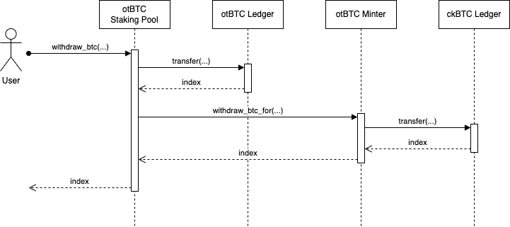

# otbtc-staking

otBTC Staking is an implementation for staking BTC on Internet Computer, built upon the ckBTC implementation. It comprises a set of canisters (smart contracts) enabling users to stake their BTC on the Internet Computer and earn rewards.

## Canisters

* otBTC Minter: The otBTC Minter canister acts as a wrapper for the ckBTC Minter canister, providing functionalities such as `get_btc_address` and `update_balance` for depositing BTC. Additionally, it facilitates the locking of ckBTC tokens for otBTC holders and offers functions for users to withdraw BTC from either the otBTC Staking Pool or otBTC Ledger.
* otBTC Ledger: This component is a standard ledger implementation utilizing the [ICP Ledger](https://github.com/dfinity/ic/tree/master/rs/rosetta-api/icp_ledger). It incorporates functionalities of the ICRC2 token standard.
* otBTC Staking Pool: The otBTC Staking Pool canister serves as a platform for otBTC holders to stake their otBTC tokens and receive rewards.

## Business Features

### Deposit BTC

The process for BTC holders to deposit their BTC to the otBTC Staking Pool canister via the ckBTC implementation proceeds as follows:

* The user obtains the deposit address by invoking the `get_btc_address` function of the otBTC Minter canister. This function, serving as a wrapper of the `get_btc_address` function of the ckBTC Minter canister, generates a BTC deposit address for the user.
* The user transfers BTC to the provided deposit address on the Bitcoin network.
* Subsequently, the user calls the `update_balance` function of the otBTC Minter canister to perform the following actions automatically:
  * Update the user's balance
  * Mint ckBTC tokens
  * Mint otBTC tokens
  * Stake the otBTC tokens into the otBTC Staking Pool.

The `update_balance` function serves as a wrapper for the `update_balance` function of the ckBTC Minter canister, incorporating additional processes:

* Update deposited BTC amount and mint ckBTC tokens: The ckBTC Minter canister mints an equivalent amount of ckBTC tokens to match the deposited BTC. These tokens are minted into a specific sub-account of the otBTC Minter canister, with the sub-account ID generated from the user's principal ID and a specified sub-account ID.
* Mint otBTC tokens: The otBTC Minter canister mints an equivalent amount of otBTC tokens as the ckBTC tokens minted. These newly minted otBTC tokens are directly transferred to a designated sub-account of the otBTC Staking Pool. The sub-account ID is generated from the user's principal ID and a specified sub-account ID.
* Inform otBTC Staking Pool: The otBTC Minter canister notifies the otBTC Staking Pool by invoking its `stake_for` function, ensuring the staked otBTC tokens are accounted for the user.

The general process flow is shown as follows:

### Stake

The process for otBTC holders to stake their otBTC tokens into the otBTC Staking Pool to earn rewards follows these steps:

* The user initiates the process by invoking the `icrc2_approve` function of the otBTC Ledger canister. This action approves the otBTC Staking Pool to transfer otBTC tokens from the user's account.
* Subsequently, the user calls the `stake` function of the otBTC Staking Pool. This function facilitates the transfer of a specified amount of otBTC tokens from the user's account to a designated sub-account of the otBTC Staking Pool. The sub-account ID is generated from the user's principal ID and a specified sub-account ID. Additionally, it updates both the user's staked amount and the total staked amount within the system.

The general process flow is shown as follows:

### Unstake

Stakers of otBTC tokens can unstake a portion or all of their otBTC tokens from the otBTC Staking Pool by invoking the `unstake` function. Following the unstaking process, the user's unstaked otBTC tokens are returned to their account.

The general process flow is shown as follows:

### Withdraw BTC from otBTC Staking Pool

Stakers of otBTC tokens can withdraw their BTC from the otBTC Staking canister through the ckBTC implementation transparently, facilitated by calling the `withdraw_btc` function of the otBTC Staking Pool. The steps involved in the `withdraw_btc` function are outlined below:

* Transfer the staked otBTC tokens to the otBTC Minter canister. This action will actually burn the otBTC tokens.
* Invoke the `withdraw_btc_for` function of the otBTC Minter canister. This function, in turn, triggers the `transfer` function of the ckBTC Ledger canister to burn the corresponding ckBTC tokens and unlock the BTC on the Bitcoin network for the user.

The general process flow is shown as follows:

### Withdraw BTC from otBTC tokens

The process for otBTC holders to withdraw their BTC from the otBTC tokens involves the following steps:

* The user initiates the process by calling the `icrc2_approve` function of the otBTC Ledger canister. This action approves the otBTC Minter to transfer otBTC tokens from the user's account.
* Subsequently, the user calls the `withdraw_btc` function of the otBTC Minter canister. This function facilitates the transfer of a specified amount of otBTC tokens from the user's account to the otBTC Minter's account. The otBTC tokens are then burned. Following this, the function invokes the `transfer` function of the ckBTC Ledger canister to burn the corresponding ckBTC tokens and unlock the BTC on the Bitcoin network for the user.

The general process flow is shown as follows:

