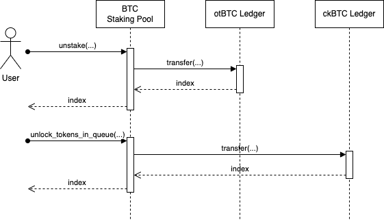

# btc-staking-icp

BTC Staking is an implementation for staking BTC on Internet Computer, built upon the ckBTC implementation. It comprises a set of canisters (smart contracts) enabling users to stake their BTC on the Internet Computer and earn rewards.

## Canisters

### BTC Staking Pool

This canister encompasses the following functionalities:

* Serving as a wrapper for the ckBTC Minter canister, the BTC Staking Pool canister provides essential functionalities like `get_btc_address` and `update_balance` for facilitating BTC deposits.
* It manages the storage of ckBTC tokens within its sub-accounts for users who deposit BTC.
* The canister handles the staking of ckBTC tokens in its main account for users seeking to acquire otBTC tokens. Additionally, it functions as a staking pool for ckBTC tokens, treating them as equivalent to BTC tokens.
* Users are offered functions to withdraw BTC from either the main account (by unstake from Staking Pool) or the sub-accounts (ckBTC escrows).

### otBTC Ledger

This component is a standard ledger implementation utilizing the [ICP Ledger](https://github.com/dfinity/ic/tree/master/rs/rosetta-api/icp_ledger). It incorporates functionalities of the ICRC2 token standard.

## Business Features

### Deposit BTC

The process for BTC holders to deposit their BTC to the BTC Staking Pool canister via the ckBTC implementation proceeds as follows:

* The user obtains the deposit address by invoking the `get_btc_deposit_address` function of the BTC Staking Pool canister. This function, serving as a wrapper of the `get_btc_address` function of the ckBTC Minter canister, generates a BTC deposit address for the user.
* The user transfers BTC to the provided deposit address on the Bitcoin network.
* Subsequently, the user calls the `update_balance` function of the BTC Staking Pool canister to update the user's BTC balance and mint ckBTC tokens for the user. The minted ckBTC tokens are then transferred to a designated sub-account of the BTC Staking Pool canister. The sub-account ID is specified by the user.

The general process flow is shown as follows:

### Stake

The process for ckBTC holders to stake their ckBTC tokens into the BTC Staking Pool to earn otBTC tokens by calling the `stake` function of the BTC Staking Pool canister proceeds as follows:

* Call `transfer` function of ckBTC Ledger to transfer a certain amount of ckBTC tokens in the corresponding sub-account of the BTC Staking Pool canister to the main account of the BTC Staking Pool canister. This action updates both the user's staked amount and the total staked amount within the system.
* Call `transfer` function of otBTC Ledger to mint the same amount of otBTC tokens to the corresponding sub-account of the BTC Staking Pool canister.

The general process flow is shown as follows:

### Unstake

Stakers of otBTC tokens can initiate the partial or complete unstaking of their otBTC tokens by invoking the `unstake` function of the BTC Staking Pool canister. The `unstake` function operates through the following steps:

* Transfer a specified amount of otBTC tokens from the sub-account of the BTC Staking Pool canister to its main account. This action effectively burns the otBTC tokens.
* Generate an unbonding request for the user, which will be queued for processing after a predetermined period. These requests are stored in the unbonding queue of the BTC Staking Pool canister.
* A trigger service periodically calls the `unlock_tokens_in_queue` function of the BTC Staking Pool canister to examine whether the first request in the unbonding queue can be executed. Upon verification, the staked ckBTC tokens corresponding to the first request are transferred from the main account of the BTC Staking Pool canister to the respective sub-account.

The general process flow is shown as follows:

### Withdraw BTC

Holders of ckBTC tokens can withdraw their BTC through the ckBTC implementation transparently, facilitated by calling the `withdraw_btc` function of the BTC Staking Pool canister. This function triggers the `transfer` function of the ckBTC Ledger canister to burn the corresponding ckBTC tokens from the corresponding sub-account of BTC Staking Pool canister and unlock the BTC on the Bitcoin network for the user.

The general process flow is shown as follows:

## BTC Staking Pool interfaces

### Update functions

| Function | Parameter | Note
|---|---|---
| get_btc_deposit_address | subaccount | The address of an Ethereum account of the user.
| update_balance | subaccount | The address of an Ethereum account of the user.
| stake | subaccount | The address of an Ethereum account of the user.
| | amount | The amount of ckBTC tokens the user wants to stake.
| | signature | The signature of the message `<nonce> stake <amount>` signed by the private key corresponding to the given Ethereum account.
| Unstake | subaccount | The address of an Ethereum account of the user.
| | amount | The amount of otBTC tokens the user wants to unstake.
| | signature | The signature of the message `<nonce> unstake <amount>` signed by the private key corresponding to the given Ethereum account.
| unlock_tokens_in_queue | N/A | -
| withdraw_btc | subaccount | The address of an Ethereum account of the user.
| | amount | The amount of ckBTC tokens the user wants to withdraw.
| | signature | The signature of the message `<nonce> withdraw_btc <amount>` signed by the private key corresponding to the given Ethereum account.
